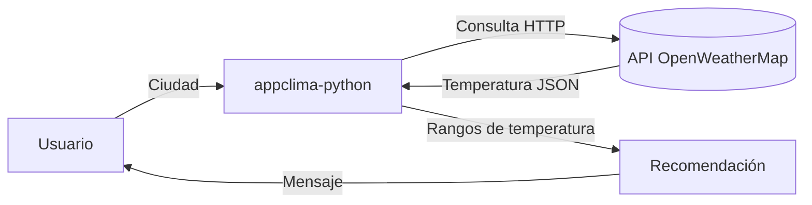

# appclima-python

Aplicación del clima en Python que muestra la temperatura de una ciudad y da recomendaciones según el clima, construida a lo largo de 7 etapas de aprendizaje.


## Tabla de Contenidos

- [Descripción](#descripción)
- [Características](#características)
- [Requisitos Previos](#requisitos-previos)
- [Instalación](#instalación)
- [Configuración](#configuración)
- [Uso](#uso)
- [Etapas del Proyecto](#etapas-del-proyecto)
- [Arquitectura](#arquitectura)
- [Stack Tecnológico](#stack-tecnológico)
- [Testing](#testing)
- [Contribución](#contribución)
- [Roadmap](#roadmap)
- [Documentación](#documentación)
- [Soporte](#soporte)
- [Versionado](#versionado)
- [Autores](#autores)
- [Licencia](#licencia)
- [Apóyanos](#apóyanos)

## Descripción

`appclima-python` es una aplicación educativa de línea de comandos que guía al lector a través de los conceptos fundamentales de la programación en Python — desde el control de flujo hasta la Programación Orientada a Objetos — mientras construye algo funcional: consultar el clima de una ciudad y recibir una recomendación según la temperatura.

Cada etapa vive en su propia carpeta (`etapa-1/` … `etapa-7/`) y añade un concepto nuevo sobre el anterior, de modo que el progreso del código refleja el progreso del aprendizaje.

### Flujo de Funcionamiento



## Características

- ✅ Consulta de temperatura por ciudad.
- ✅ Recomendaciones según el clima (calor 🔥, agradable 😊, frío ❄️).
- ✅ Consumo de la API real de OpenWeatherMap (etapas 6 y 7).
- ✅ Refactorización a Programación Orientada a Objetos (etapa 7).
- ✅ Progresión didáctica en 7 etapas independientes.

## Requisitos Previos

Antes de comenzar, asegúrate de tener instalado:

- **Python**: v3.8 o superior
- **pip**: gestor de paquetes de Python
- **requests**: cliente HTTP (`pip install requests`)

### Accesos Necesarios

- Una **API KEY de OpenWeatherMap** para las etapas 6 y 7. Consíguela gratis en [OpenWeatherMap](https://home.openweathermap.org/api_keys).

## Instalación

### 1. Clonar el repositorio

```bash
git clone https://github.com/brayandiazc/appclima-python.git
cd appclima-python
```

### 2. Instalar dependencias

```bash
pip install requests
```

### 3. Configurar variables de entorno

```bash
cp .env.example .env
# Edita .env y coloca tu API_KEY de OpenWeatherMap
```

## Configuración

Las variables de entorno se documentan en [`.env.example`](.env.example). Cópialo a `.env` y completa los valores para tu entorno.

> Nunca subas tu archivo `.env` con valores reales al repositorio. Ver [SECURITY.md](SECURITY.md) y [`docs/conventions/secrets.md`](docs/conventions/secrets.md).

## Uso

Cada etapa se ejecuta de forma independiente. Por ejemplo:

```bash
python etapa-1/main.py   # Primera etapa
python etapa-2/main.py   # Segunda etapa
# ... y así sucesivamente hasta:
python etapa-7/main.py   # Versión orientada a objetos
```

Las etapas 6 y 7 requieren una `API_KEY` de OpenWeatherMap configurada.

## Etapas del Proyecto

1. **Control de Flujo Básico** — estructuras condicionales simples.
2. **Ciclos e Iteraciones** — bucles para mejorar la interacción con el usuario.
3. **Creación y Uso de Funciones** — reutilización de código con funciones.
4. **Manejo de Arreglos y Persistencia de Datos** — listas y almacenamiento.
5. **Uso de Diccionarios** — organización y consulta eficiente de datos.
6. **Consumo de APIs** — integración con OpenWeatherMap.
7. **Programación Orientada a Objetos** — refactorización con clases y objetos.

## Arquitectura

Aplicación CLI en Python, sin base de datos ni servidor, organizada por etapas progresivas. Detalle completo en [`docs/architecture/architecture.md`](docs/architecture/architecture.md).

## Stack Tecnológico

Python 3.8+, la librería `requests` y la API de OpenWeatherMap. Inventario completo en [`docs/architecture/stack.md`](docs/architecture/stack.md).

## Testing

El proyecto aún no incluye una suite de pruebas automatizadas. La convención de testing sugerida (pytest) se documenta en [`docs/conventions/testing.md`](docs/conventions/testing.md).

## Contribución

Lee la [Guía de Contribución](CONTRIBUTING.md) para conocer el flujo de trabajo (Git Flow), los estándares de código, el formato de commits (Conventional Commits) y el proceso de Pull Requests.

## Roadmap

Visión y próximos pasos en [`docs/product/roadmap.md`](docs/product/roadmap.md).

## Documentación

Toda la documentación vive en [`docs/`](docs/README.md):

| Documento                                                                | Responde a                       |
| ------------------------------------------------------------------------ | -------------------------------- |
| [`docs/architecture/architecture.md`](docs/architecture/architecture.md) | ¿Cómo está construido?           |
| [`docs/architecture/stack.md`](docs/architecture/stack.md)               | ¿Con qué tecnologías?            |
| [`docs/architecture/api.md`](docs/architecture/api.md)                   | ¿Qué API externa consume?        |
| [`docs/architecture/design.md`](docs/architecture/design.md)             | ¿Cómo se diseña y por qué?       |
| [`docs/product/roadmap.md`](docs/product/roadmap.md)                      | ¿Hacia dónde va?                 |
| [`docs/decisions/`](docs/decisions/README.md)                            | ¿Por qué tomamos cada decisión?  |
| [`docs/conventions/`](docs/conventions/README.md)                        | ¿Cómo trabajamos en este repo?   |

## Soporte

¿Problemas o sugerencias? Abre un issue en [el repositorio](https://github.com/brayandiazc/appclima-python/issues) o escribe a <brayandiazc@gmail.com>.

## Versionado

Usamos [Git](https://git-scm.com) para el control de versiones y seguimos [Semantic Versioning](https://semver.org/). Consulta las [etiquetas](https://github.com/brayandiazc/appclima-python/tags) para ver las versiones disponibles y el [CHANGELOG](CHANGELOG.md).

## Autores

- **Brayan Diaz C** — _Trabajo inicial_ — [@brayandiazc](https://github.com/brayandiazc)

Consulta también la lista de [contribuidores](https://github.com/brayandiazc/appclima-python/contributors).

## Licencia

Este proyecto está bajo la licencia [MIT](LICENSE).

## Apóyanos

Si este proyecto te resulta útil y quieres apoyar su desarrollo:

- [GitHub Sponsors](https://github.com/sponsors/brayandiazc)
- [Ko-fi](https://ko-fi.com/brayandiazc)

---

⌨️ con ❤️ por [@brayandiazc](https://github.com/brayandiazc) 😊
