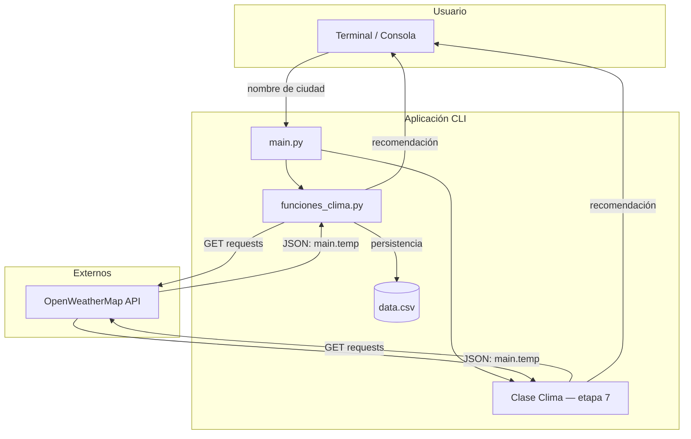
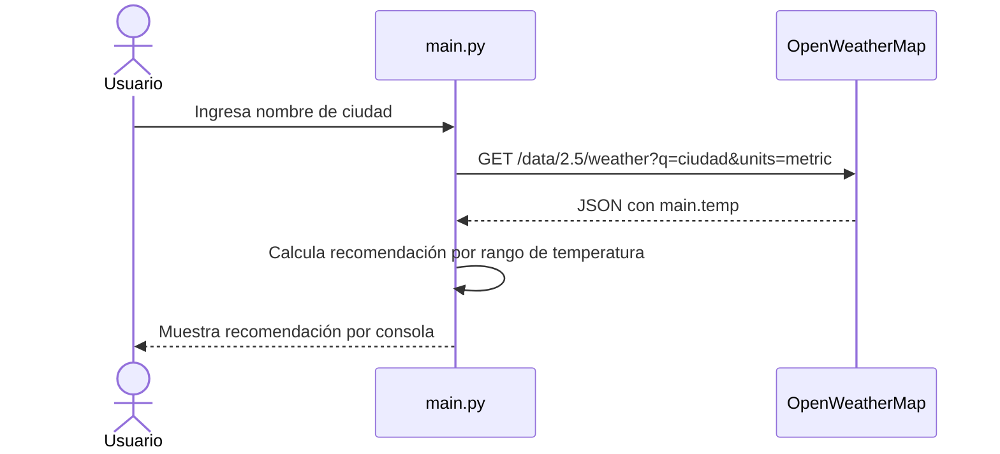

# appclima-python — Arquitectura

> Vista de alto nivel de cómo está construido el sistema y cómo se reparten las
> responsabilidades. Para el stack real (versiones, librerías) ver
> [`stack.md`](stack.md). Para el propósito del proyecto ver
> [`../product/business-model.md`](../product/business-model.md).
>
> **Última actualización**: 2026-07-02

## Resumen

`appclima-python` es una aplicación de línea de comandos (CLI) educativa escrita
en Python. No tiene servidor web, base de datos ni autenticación de usuarios:
se ejecuta localmente con `python etapa-N/main.py`. El proyecto está organizado
en **7 etapas de aprendizaje progresivas**, cada una en su carpeta `etapa-N/`,
que van desde el control de flujo básico hasta la Programación Orientada a
Objetos.

## Diagrama

## Componentes

| Componente                          | Responsabilidad                                                                                   | Tecnología     |
| ----------------------------------- | ------------------------------------------------------------------------------------------------- | -------------- |
| `main.py`                           | Punto de entrada de cada etapa. Pide la ciudad, orquesta la consulta y muestra la salida.         | Python         |
| `funciones_clima.py`                | Módulo de funciones: `obtener_clima`, `mostrar_recomendacion` y `guardar_en_archivo` (CSV).       | Python         |
| Clase `Clima` (`clima.py`, etapa 7) | Encapsula ciudad y temperatura; expone `obtener_y_mostrar_clima` y consume la API internamente.    | Python (POO)   |
| OpenWeatherMap API                  | Servicio externo que provee la temperatura actual de la ciudad (etapas 6 y 7).                     | HTTP / JSON    |

## Decisiones clave

| Decisión                                              | Razón                                                                                          |
| ----------------------------------------------------- | ---------------------------------------------------------------------------------------------- |
| Organizar el proyecto en 7 etapas didácticas          | Permite aprender los fundamentos de Python de forma incremental, un concepto por etapa.        |
| Usar la librería `requests` para consumir la API      | Es el cliente HTTP más común y sencillo de Python, ideal para enseñar consumo de APIs.         |
| Introducir POO en la etapa final (clase `Clima`)      | Consolida el aprendizaje encapsulando la lógica de las etapas anteriores en una clase.          |
| Persistir consultas en un CSV local (`data.csv`)      | Demuestra persistencia simple sin necesidad de una base de datos.                              |

## Reglas no negociables

- Cada etapa debe ejecutarse de forma independiente con `python etapa-N/main.py`.
- El código de cada etapa solo usa conceptos ya introducidos hasta esa etapa.
- Las etapas 6 y 7 requieren una API KEY válida de OpenWeatherMap.

## Flujos principales

## Referencias

- [`stack.md`](stack.md) — stack tecnológico y versiones.
- [`api.md`](api.md) — API externa consumida (OpenWeatherMap).
- [`design.md`](design.md) — diseño técnico y rangos de recomendación.
- [`../conventions/`](../conventions/README.md) — convenciones de trabajo.
